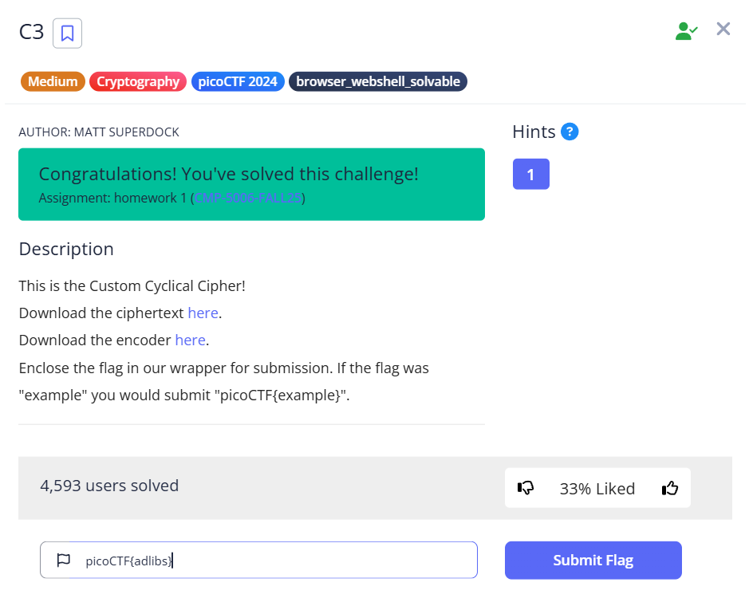
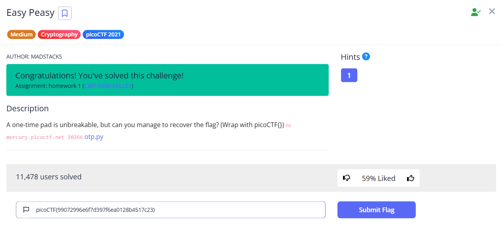
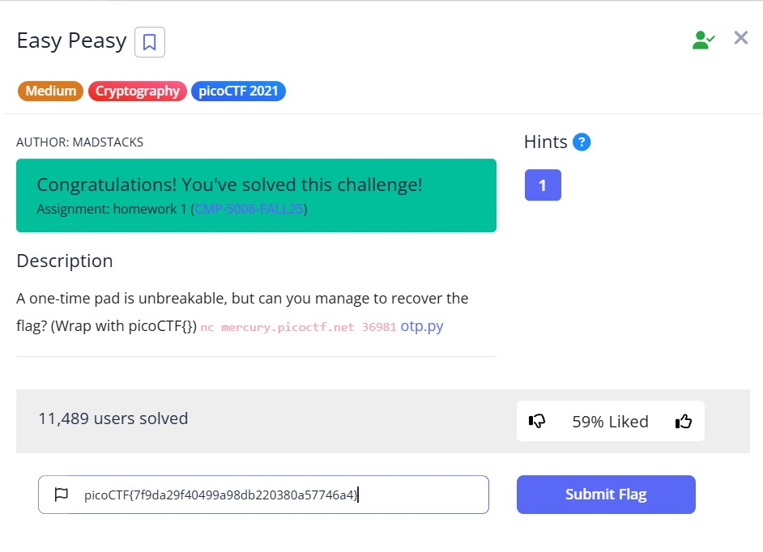
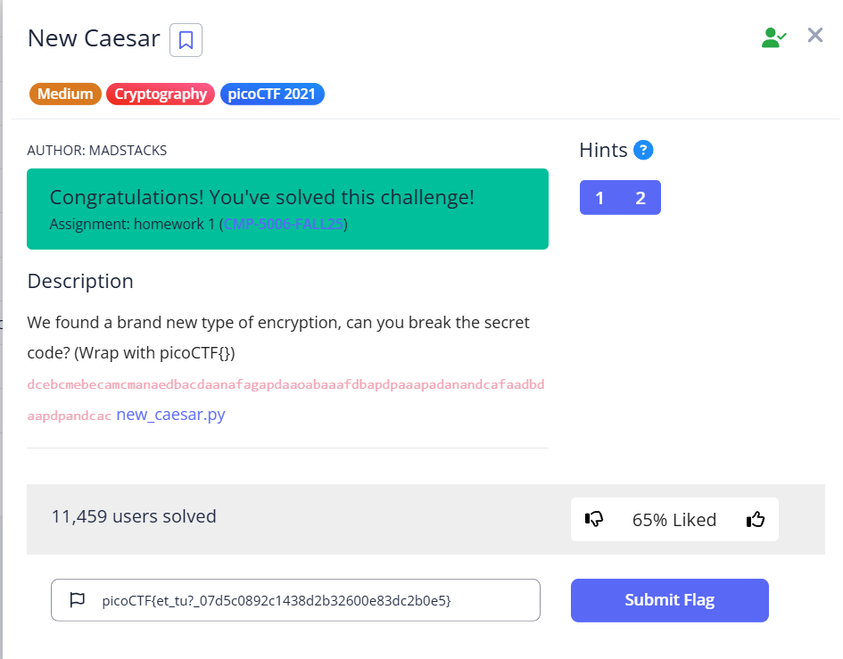
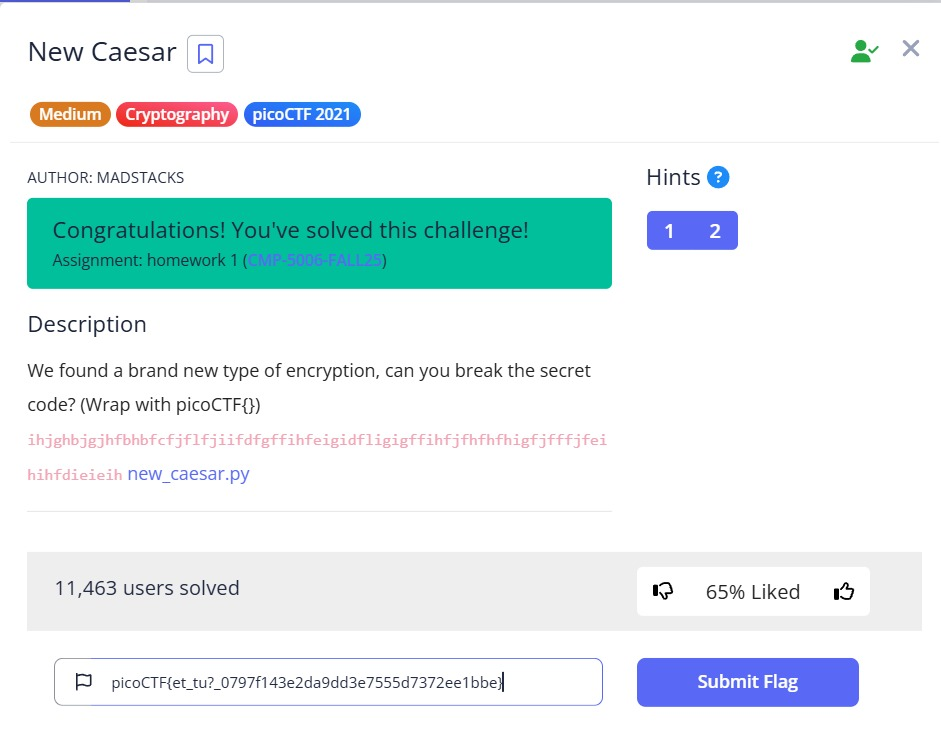
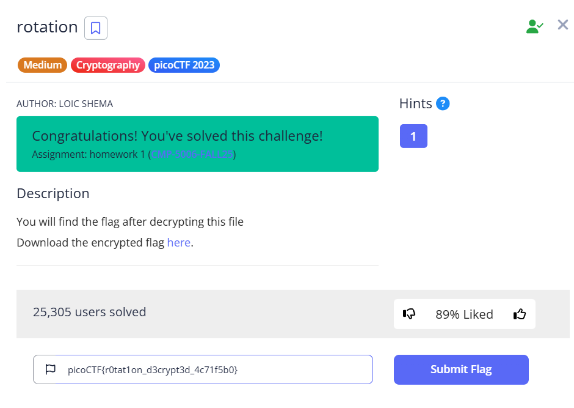
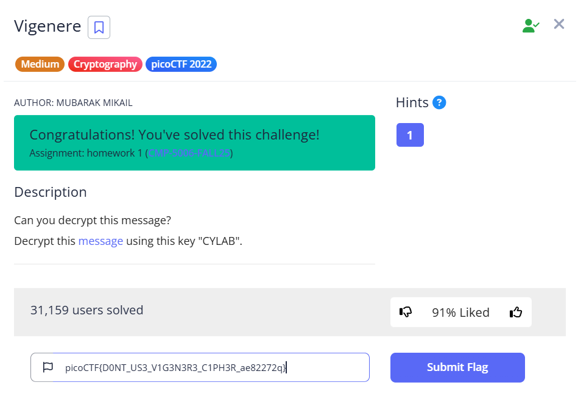

# Parte 3 — PicoCTF 

## Índice

- [C3](#c3)
- [EasyPeasy (OTP)](#easypeasy)
- [NewCaesar](#newcaesar)
- [rotation](#rotation)
- [Vigenere](#vigenere)
- [Resumen de banderas](#resumen)

<a name="c3"></a>

## 1) C3

Este desafío presenta un sistema de cifrado personalizado que utiliza dos alfabetos de 40 caracteres cada uno y una lógica de codificación que hace que cada símbolo cifrado dependa del anterior.

#### 1.1 Contenido del ciphertext 
```
DLSeGAGDgBNJDQJDCFSFnRBIDjgHoDFCFtHDgJpiHtGDmMAQFnRBJKkBAsTMrsPSDDnEFCFtIbEDtDCIbFCFtHTJDKerFldbFObFCFtLBFkBAAAPFnRBJGEkerFlcPgKkImHnIlATJDKbTbFOkdNnsgbnJRMFnRBNAFkBAAAbrcbTKAkOgFpOgFpOpkBAAAAAAAiClFGIPFnRBaKliCgClFGtIBAAAAAAAOgGEkImHnIl
```

Este es exactamente el contenido cifrado que se recibió en el reto, sin ninguna modificación.

#### 1.2 Contenido del decoded_script.py (resultado tras descifrar)
```python
#asciiorder
#fortychars
#selfinput
#pythontwo

chars = ""
from fileinput import input
for line in input():
    chars += line
b = 1 / 1

for i in range(len(chars)):
    if i == b * b * b:
        print chars[i] #prints
        b += 1 / 1
```

Una vez descifrado el texto, obtenemos este script en Python que contiene algunas pistas importantes en los comentarios.

#### 1.3 Método A — Análisis matemático (ingeniería inversa)  del algoritmo de cifrado y su inversión.

Para resolver este desafío, es necesario entender cómo funciona el algoritmo de cifrado. El sistema utiliza dos alfabetos personalizados de 40 caracteres y una variable acumuladora que hace que cada carácter cifrado dependa del anterior.

**El algoritmo de cifrado original funciona así:**
```
out += lookup2[(cur - prev) % 40]
prev = cur
```

donde `cur` es el índice del carácter actual en el primer alfabeto y `prev` es el valor acumulado del carácter anterior.

**Para revertir el proceso, se necesita hacer lo contrario:**

Para cada carácter `c` del texto cifrado:
1. Encontrar `k` como la posición de `c` en `lookup2`
2. Calcular `cur = (prev + k) % 40`
3. El carácter descifrado es `lookup1[cur]`
4. Actualizar `prev = cur` para el siguiente carácter

Al aplicar este proceso, el texto cifrado se convierte en el script de Python mostrado arriba. Pero aquí hay un detalle crucial: el script debe ejecutarse con Python 2, no Python 3. La razón es que en Python 2, `1/1` resulta en `1` (entero), mientras que en Python 3 resulta en `1.0` (flotante), lo que cambia completamente el comportamiento del programa.

Cuando se ejecuta el script con su propio contenido como entrada (self-input), imprime letras en posiciones cúbicas (0, 1, 8, 27, etc.), que al concatenarse forman **"adlibs"**.

#### 1.4 Método B — Implementación programática

Para quienes prefieren automatizar el proceso, aquí está la implementación completa del decodificador:

```python
#!/usr/bin/env python3
# decode_40alphabet.py 

import argparse, re, sys

# Alfabetos del encoder oficial del reto (longitud 40)
LOOKUP1 = "\n \"#()*+/1:=[]abcdefghijklmnopqrstuvwxyz"
LOOKUP2 = "ABCDEFGHIJKLMNOPQRSTabcdefghijklmnopqrst"

def decode(ciphertext: str) -> str:
    """Invierte el encoder C3: de LOOKUP2 -> LOOKUP1 usando suma cíclica."""
    prev = 0
    out = []
    for ch in ciphertext:
        k = LOOKUP2.find(ch)
        if k == -1:
            raise ValueError(f"Carácter inesperado en ciphertext: {repr(ch)} (no está en LOOKUP2)")
        cur = (prev + k) % 40
        out.append(LOOKUP1[cur])
        prev = cur
    return "".join(out)

def encode(plaintext: str) -> str:
    """Replica el encoder oficial: de LOOKUP1 -> LOOKUP2 usando diferencia cíclica."""
    prev = 0
    out = []
    for ch in plaintext:
        cur = LOOKUP1.find(ch)
        if cur == -1:
            raise ValueError(f"Carácter inesperado en plaintext: {repr(ch)} (no está en LOOKUP1)")
        out.append(LOOKUP2[(cur - prev) % 40])
        prev = cur
    return "".join(out)

def main():
    p = argparse.ArgumentParser(description="Solver C3 (Custom Cyclical Cipher)")
    p.add_argument("--input", "-i", default="ciphertext", help="ruta al archivo de entrada (por defecto: ciphertext)")
    p.add_argument("--mode", "-m", choices=["decode","encode"], default="decode",
                   help="decode (por defecto) o encode (para verificación)")
    p.add_argument("--out", "-o", default="", help="archivo de salida opcional")
    args = p.parse_args()

    # Lee como texto (incluye \n). Este reto es textual, no binario.
    with open(args.input, "r", encoding="utf-8", errors="ignore") as f:
        data = f.read()

    if args.mode == "decode":
        plain = decode(data)
        print(plain)
        # extrae flag si existe
        m = re.search(r"picoCTF\{[^}]+\}", plain)
        if m:
            flag = m.group(0)
            print("[FLAG]", flag)
            with open("flag.txt","w",encoding="utf-8") as g:
                g.write(flag + "\n")
    else:
        # encode: útil para verificar round-trip
        ct = encode(data)
        print(ct)

    # salida a archivo opcional
    if args.out:
        with open(args.out, "w", encoding="utf-8") as h:
            h.write(plain if args.mode=="decode" else ct)

if __name__ == "__main__":
    main()
```

**¿Cómo funciona este script?**

- Define los dos alfabetos exactos que usa el sistema de cifrado
- La función `decode()` implementa el algoritmo inverso matemáticamente correcto
- Para cada carácter cifrado, encuentra su posición en `LOOKUP2`, calcula la posición original y recupera el carácter correspondiente de `LOOKUP1`
- La variable `prev` mantiene el estado acumulativo necesario para el descifrado

Tanto el Método A como el Método B producen el mismo resultado: el script de Python que, cuando se ejecuta con Python 2 y alimentado con su propio contenido, revela la secuencia "adlibs".


### 1.5 Flag 
```
picoCTF{adlibs}
```



**Nota importante:** El Método A y el Método B sirven tanto para Anahí como para Mateo. Ambos pudieron ejecutar los mismos métodos y obtener una misma flag porque trabajaron con la misma entrada/instancia (mismo ciphertext o mismo servicio). El proceso determinista devolvió la misma flag para ambos estudiantes y, por esa razón, solo se muestra un único screenshot.

---

<a name="easypeasy"></a>

## 2) EasyPeasy (OTP)

Este desafío implementa un servicio de One-Time Pad (OTP) con una vulnerabilidad crítica: la reutilización del keystream cuando el puntero de la clave hace wrap-around.

### Análisis técnico del sistema

El servicio utiliza una clave de 50,000 bytes (`KEY_LEN = 50000`). Al conectarse, muestra una flag cifrada en hexadecimal. Después, cualquier texto que envíes se cifra con XOR usando la porción actual de la clave, y el puntero avanza. Cuando el puntero supera los 50,000 bytes, vuelve a 0.

**La vulnerabilidad clave está en la reutilización del keystream.** Si podemos hacer que el servidor use la misma porción de la clave tanto para cifrar la flag como para cifrar un texto que nosotros conocemos, podemos recuperar esa porción de la clave y descifrar la flag.

**La matemática es simple gracias a las propiedades del XOR:**
```
enc_flag = flag ⊕ key_portion
ct_known = known_text ⊕ key_portion
=> key_portion = ct_known ⊕ known_text
=> flag = enc_flag ⊕ key_portion
```

### Ejecución — Estudiante A
**Flag cifrada que mostró el servidor:**
```
5b1e564b6e415c0e394e0401384b08553a4e5c597b6d4a5c5a684d50013d6e4b
```

**Flag recuperada:**
```
99072996e6f7d397f6ea0128b4517c23
```

#### Método A — Demostración local (Prueba de concepto), explicación de la vulnerabilidad y de la propiedad algebraica del XOR.

Para entender mejor el funcionamiento, se puede recrear localmente el servicio OTP. Esto permite experimentar con el wrap-around del puntero y verificar que la técnica funciona antes de aplicarla al servidor remoto.

#### Método B — Exploit remoto automático

La implementación práctica del exploit requiere coordinar cuidadosamente el envío de datos para sincronizar el puntero de la clave:

```python
#!/usr/bin/env python3
import socket, argparse, re

KEY_LEN = 50000

def is_hex(s): 
    return bool(re.fullmatch(r'[0-9a-fA-F]+', s))

def read_encflag(f):
    enc = None
    for i in range(50):
        line = f.readline()
        if not line: break
        ln = line.strip()
        print(f"[srv {i+1}] {ln}")
        if is_hex(ln):
            enc = ln
            print("[*] got encrypted-flag hex")
            break
    return enc

def read_cipher_for_len(f, expected_bytes):
    """Lee líneas hasta obtener una de hex con longitud EXACTA 2*expected_bytes."""
    want = expected_bytes * 2
    while True:
        line = f.readline()
        if not line:
            raise RuntimeError("connection closed while waiting ciphertext")
        ln = line.strip()
        # salta líneas no-hex (p.ej., 'Here ya go!')
        if not is_hex(ln):
            continue
        if len(ln) == want:
            return ln

def bxor(a,b): 
    return bytes(x^y for x,y in zip(a,b))

def hex2b(h): 
    return bytes.fromhex(h)

def exploit(host, port):
    print(f"[*] connect {host}:{port}")
    s = socket.create_connection((host, port), timeout=10)
    f = s.makefile('rw', encoding='utf-8', newline='\n')

    enc_flag_hex = read_encflag(f)
    if not enc_flag_hex: 
        raise RuntimeError("no encrypted flag in banner")
    
    flag_len = len(enc_flag_hex)//2
    print(f"[*] flag_len = {flag_len}")

    # Calculamos cuántos bytes necesitamos enviar para que el puntero
    # vuelva exactamente al inicio (donde se cifró la flag)
    filler_len = (KEY_LEN - flag_len) % KEY_LEN
    print(f"[*] sending filler len {filler_len}")
    f.write("A"*filler_len + "\n")
    f.flush()

    # Consumir la respuesta del filler
    _ = read_cipher_for_len(f, filler_len)

    # Ahora enviamos nuestro texto conocido
    known = "A"*flag_len
    print(f"[*] sending known len {flag_len}")
    f.write(known + "\n")
    f.flush()

    ct_hex = read_cipher_for_len(f, flag_len)
    
    # Recuperamos la clave y desciframos la flag
    enc_flag = hex2b(enc_flag_hex)
    ct2 = hex2b(ct_hex)
    key_pref = bxor(ct2, known.encode())
    flag = bxor(enc_flag, key_pref)
    
    try:
        print("[+] FLAG:", flag.decode())
    except:
        print("[+] FLAG (bytes):", flag)
    
    s.close()

if __name__ == "__main__":
    ap = argparse.ArgumentParser()
    ap.add_argument("--host", default="mercury.picoctf.net")
    ap.add_argument("--port", type=int, default=20266)
    a = ap.parse_args()
    exploit(a.host, a.port)
```

**¿Cómo funciona este exploit?**

1. **Conexión y lectura del banner:** El script se conecta y extrae la flag cifrada del mensaje inicial
2. **Cálculo del filler:** Determina exactamente cuántos bytes enviar para hacer que el puntero vuelva al inicio
3. **Sincronización:** Envía el filler y consume la respuesta para sincronizar el estado
4. **Texto conocido:** Envía un texto que conocemos (por ejemplo, "AAA...") del mismo tamaño que la flag
5. **Recuperación de clave:** Usa XOR entre el texto conocido y su versión cifrada para obtener la porción de clave
6. **Descifrado final:** Aplica esa porción de clave a la flag cifrada original

**Resultado (Ejecución Estudiante A):**
```
picoCTF{99072996e6f7d397f6ea0128b4517c23}
```

**Evidencia:** 




### Ejecución — Estudiante B

**Servidor usado:** `mercury.picoctf.net:36981`

**Flag cifrada observada:**
```
5541103a246e415e036c4c5f0e3d415a513e4a560050644859536b4f57003d4c
```

**Flag recuperada:**
```
7f9da29f40499a98db220380a57746a4
```

**Evidencia:** 




### Puntos importantes

La misma técnica y el mismo código funcionan para ambas instancias. Las flags son diferentes porque cada instancia del servicio puede usar una clave diferente y cifrar la flag en diferentes posiciones. Sin embargo, la vulnerabilidad fundamental y el método de explotación son idénticos.

---

<a name="newcaesar"></a>

## 3) NewCaesar

Este desafío presenta una variante interesante del cifrado César que opera a nivel de nibbles (medio byte) usando representación textual.

### Funcionamiento del sistema

El esquema funciona de la siguiente manera:
- Cada byte se descompone en dos nibbles (4 bits cada uno)
- Cada nibble se representa como una letra del alfabeto `a` a `p` (16 letras, equivalente a hexadecimal)
- Se aplica un desplazamiento César con una clave `k` (valor de 0 a 15) a cada nibble
- Para descifrar, se resta `k` (módulo 16) a cada par de letras y se recombina en bytes

### Ciphertext de estudiante A
```
dcebcmebecamcmanaedbacdaanafagapdaaoabaaafdbapdpaaapadanandcafaadbdaapdpandcac
```

#### Método A — Ataque de texto conocido (asumiendo que empieza con picoCTF{ y deducir k).

Una primera aproximación fue intentar deducir la clave asumiendo que el texto plano comienza con `picoCTF{`. Sin embargo, al codificar este prefijo en la representación base-16 textual y comparar con el inicio del texto cifrado, la deducción resultó ambigua y no proporcionó un valor único para `k`.

#### Método B — Fuerza bruta sistemática

Dado que la clave solo puede tomar 16 valores diferentes (0-15), la fuerza bruta es completamente factible:

```python
#!/usr/bin/env python3
import string, sys

ALPHABET = string.ascii_lowercase[:16]
idx = {c:i for i,c in enumerate(ALPHABET)}

def decode_with_k(ct, k):
    b = bytearray()
    for i in range(0, len(ct), 2):
        c1, c2 = ct[i], ct[i+1]
        orig1 = (idx[c1] - k) % 16
        orig2 = (idx[c2] - k) % 16
        b.append((orig1 << 4) | orig2)
    return bytes(b)

def printable_ratio(bs):
    if not bs: return 0.0
    cnt = sum(1 for c in bs if 32 <= c <= 126) # printable ascii range
    return cnt / len(bs)

def main():
    import argparse
    p = argparse.ArgumentParser()
    p.add_argument("--cipher", help="cipher file (letters a-p)", required=True)
    args = p.parse_args()
    
    ct = open(args.cipher,'r').read().strip()
    ct = ''.join(ch for ch in ct if ch in ALPHABET)
    
    if len(ct) % 2 != 0:
        print("[!] ciphertext odd length after cleaning; trimming last char")
        ct = ct[:-1]
    
    print("[*] ciphertext length:", len(ct))
    candidates = []
    
    for k in range(16):
        try:
            pt = decode_with_k(ct, k)
            ratio = printable_ratio(pt)
            s = pt.decode('utf-8', errors='replace')
        except Exception as e:
            ratio = 0.0
            s = repr(e)
        candidates.append((k, ratio, s))
    
    # Ordenar por ratio de caracteres imprimibles (descendente)
    candidates.sort(key=lambda x: x[1], reverse=True)
    
    for k, ratio, s in candidates:
        mark = "  "
        if ratio > 0.6: 
            mark = ">>"
        print(f"{mark} key={k:2d}  printable_ratio={ratio:.2f}  -> {s}")
    
    print("\n[*] If one of the outputs looks like a flag body, wrap it in picoCTF{...}")

if __name__ == '__main__':
    main()
```

**¿Cómo funciona este script?**

- **Procesamiento del texto:** Limpia el input manteniendo solo las letras a-p válidas
- **Decodificación sistemática:** Prueba todas las 16 claves posibles
- **Evaluación de calidad:** Calcula qué porcentaje de la salida son caracteres ASCII imprimibles
- **Ranking inteligente:** Ordena los resultados por legibilidad, facilitando identificar la salida correcta

### Resultado (Estudiante A)

```
key=13 → et_tu?_07d5c0892c1438d2b32600e83dc2b0e5
Flag: picoCTF{et_tu?_07d5c0892c1438d2b32600e83dc2b0e5}
```

**Evidencia:**




### Caso Estudiante B

Se trabajó con un texto cifrado diferente:
```
ihjghbjgjhfbhbfcfjflfjiifdfgffihfeigidfligigffihfjfhfhfhigfjfffjfeihihfdieieih
```

Aplicando exactamente el mismo script, se obtuvo `key=2` como la clave que produce el texto más legible:
```
et_tu?_0797f143e2da9dd3e7555d7372ee1bbe
```

### Flag 
```
picoCTF{et_tu?_0797f143e2da9dd3e7555d7372ee1bbe}
```

**Evidencia:**




### Observaciones importantes

El algoritmo resuelve ambos casos usando exactamente los mismos métodos. La diferencia en las flags proviene únicamente de que los textos cifrados de entrada eran diferentes, pero la vulnerabilidad fundamental y la técnica de solución permanecen constantes.

---

<a name="rotation"></a>

## 4) rotation

Este es un desafío clásico de cifrado por rotación (ROT) con un twist interesante en la preservación de ciertos caracteres.

### Ciphertext 
```
xqkwKBN{z0bib1wv_l3kzgxb3l_4k71n5j0}
```

#### Método A — Deducción analítica con el cálculo del desplazamiento analizando la diferencia entre x y p.

La estrategia inicial fue asumir que el texto plano comienza con `picoCTF{`, que es el formato estándar de las flags.

**Cálculo del desplazamiento:**
```
n = (ord('p') - ord('x')) % 26
```

Sin embargo, hay un detalle crucial: el texto cifrado contiene dígitos (`0`, `1`, `3`, `4`, `7`, `5`) que se mantienen intactos en el resultado esperado. Esto sugiere que la rotación se aplica **únicamente a las letras**, preservando los números y símbolos especiales.

Esto tiene sentido porque el resultado final contiene notación "leet speak" donde los dígitos sustituyen letras (0→o, 1→i, 3→e). Si rotáramos también los dígitos, obtendríamos un resultado completamente diferente al esperado.

#### Método B — Fuerza bruta sistemática

Para confirmar la hipótesis y encontrar el desplazamiento correcto, se puede probar todas las rotaciones posibles:

```python
def rot_letters_only(s, n):
    def rot_char(ch):
        if 'a' <= ch <= 'z':
            return chr((ord(ch) - ord('a') + n) % 26 + ord('a'))
        if 'A' <= ch <= 'Z':
            return chr((ord(ch) - ord('A') + n) % 26 + ord('A'))
        return ch  # Mantiene dígitos y símbolos sin cambios
    return ''.join(rot_char(c) for c in s)

# Probar todas las rotaciones
ciphertext = "xqkwKBN{z0bib1wv_l3kzgxb3l_4k71n5j0}"
for n in range(26):
    result = rot_letters_only(ciphertext, n)
    if "picoCTF{" in result:
        print(f"ROT+{n}: {result}")
```

**¿Por qué rotar solo las letras?**

1. **Preservación de formato:** Los dígitos en el texto cifrado (`0`, `1`, `3`, etc.) aparecen también en la flag final
2. **Leet speak:** La notación leet es común en CTFs, donde números sustituyen letras visualmente similares
3. **Consistencia:** Si rotáramos también los números, el resultado no sería reconocible como una flag válida

### Desplazamiento encontrado

**ROT+18** es la rotación correcta que transforma el texto cifrado en la flag.

### Resultado

Al aplicar ROT+18 únicamente a las letras del texto cifrado:

```
picoCTF{r0tat1on_d3crypt3d_4c71f5b0}
```

**Flag:**
```
picoCTF{r0tat1on_d3crypt3d_4c71f5b0}
```



**Nota importante:** El Método A y el Método B sirven tanto para Anahí como para Mateo. Ambos pudieron ejecutar los mismos métodos y obtener una misma flag porque trabajaron con la misma entrada/instancia (mismo ciphertext o mismo servicio). El proceso determinista devolvió la misma flag para ambos estudiantes y, por esa razón, solo se muestra un único screenshot.

---

<a name="vigenere"></a>

## 5) Vigenere

Este desafío implementa el cifrado clásico de Vigenère, un sistema polialfabético que utiliza una palabra clave para determinar los desplazamientos.

### Ciphertext 

```
rgnoDVD{O0NU_WQ3_G1G3O3T3_A1AH3S_cc82272b}
```

### Clave

```
CYLAB
```

#### Método A — Descifrado manual  aplicando la fórmula p = (c - k) mod 26 con la clave CYLAB.

El cifrado Vigenère funciona aplicando desplazamientos César variables según una clave que se repite:

**Fórmulas fundamentales:**
* Cifrado: `c = (p + k) mod 26` (donde A=0, B=1, ...)
* Descifrado: `p = (c - k) mod 26`

**Conversión de la clave a desplazamientos numéricos:**

```
C → 2
Y → 24  
L → 11
A → 0
B → 1
```

**Proceso paso a paso:**

1. Se recorre el texto cifrado carácter por carácter
2. Para cada **letra** (mayúscula o minúscula):
   * Se obtiene el desplazamiento correspondiente de la clave actual
   * Se resta ese desplazamiento (módulo 26) al carácter cifrado
   * Se avanza la posición en la clave
3. Para caracteres **no alfabéticos** (números, símbolos, llaves):
   * Se copian tal cual **sin consumir** la clave

**Ejemplo práctico con el primer carácter:**
* Carácter cifrado: `r` (índice 17 si a=0)
* Clave actual: `C` (desplazamiento 2)
* Cálculo: `17 - 2 = 15` → letra `p`

Este método manual demuestra la comprensión completa del algoritmo Vigenère y permite verificar cada paso del proceso.

#### Método B — Implementación programática

Para automatizar el proceso y manejar textos más largos de manera eficiente:

```python
#!/usr/bin/env python3
KEY = "CYLAB"

def decrypt_vigenere(ct, key):
    res = []
    ki = 0  # Índice en la clave (solo avanza con letras)
    
    for ch in ct:
        if 'A' <= ch <= 'Z':
            # Procesar letra mayúscula
            shift = ord(key[ki % len(key)].upper()) - ord('A')
            val = (ord(ch) - ord('A') - shift) % 26
            res.append(chr(val + ord('A')))
            ki += 1  # Consumir posición de la clave
            
        elif 'a' <= ch <= 'z':
            # Procesar letra minúscula
            shift = ord(key[ki % len(key)].upper()) - ord('A')
            val = (ord(ch) - ord('a') - shift) % 26
            res.append(chr(val + ord('a')))
            ki += 1  # Consumir posición de la clave
            
        else:
            # Caracteres no alfabéticos se copian sin cambios
            # IMPORTANTE: no se avanza ki
            res.append(ch)
    
    return ''.join(res)
```

**Explicación detallada del algoritmo:**

- **`res = []`**: Lista para acumular caracteres del texto plano
- **`ki = 0`**: Índice lógico en la clave que **solo avanza** al procesar letras
- **Rama mayúsculas (`'A' <= ch <= 'Z'`):**
  - `shift = ...` obtiene el valor numérico del carácter actual de la clave
  - `val = (ord(ch) - ord('A') - shift) % 26` realiza la resta modular para descifrar
  - `res.append(...)` convierte el resultado numérico de vuelta a carácter
  - `ki += 1` avanza la posición de la clave
- **Rama minúsculas:** Similar pero usando `ord('a')` como base
- **Rama otros caracteres:** Copia sin cambios y **no avanza `ki`**

**Punto clave:** Los caracteres no alfabéticos no consumen la clave. Esto es fundamental para que la sincronización sea correcta.

### Resultado 

Aplicando cualquiera de los dos métodos con `KEY = "CYLAB"` al texto cifrado:

```
picoCTF{D0NT_US3_V1G3N3R3_C1PH3R_ae82272q}
```

### Flag 

```
picoCTF{D0NT_US3_V1G3N3R3_C1PH3R_ae82272q}
```


**Nota importante:** El Método A y el Método B sirven tanto para Anahí como para Mateo. Ambos pudieron ejecutar los mismos métodos y obtener una misma flag porque trabajaron con la misma entrada/instancia (mismo ciphertext o mismo servicio). El proceso determinista devolvió la misma flag para ambos estudiantes y, por esa razón, solo se muestra un único screenshot.

---

<a name="resumen"></a>

## Resumen de banderas 

| Reto                                 | Flag (instancia usada)                                                              |
| ------------------------------------ | ----------------------------------------------------------------------------------- |
| C3                                   | `picoCTF{adlibs}`                                                                   |
| EasyPeasy (Estudiante A)         | `picoCTF{99072996e6f7d397f6ea0128b4517c23}`                                         |
| EasyPeasy (Estudiante B) | `picoCTF{7f9da29f40499a98db220380a57746a4}`                   |
| NewCaesar (Estudiante A)       | `picoCTF{et_tu?_07d5c0892c1438d2b32600e83dc2b0e5}`                                  |
| NewCaesar (Estudiante B)   | `picoCTF{et_tu?_0797f143e2da9dd3e7555d7372ee1bbe}` *(mismo método pero con input diferente)* |
| rotation                             | `picoCTF{r0tat1on_d3crypt3d_4c71f5b0}`                                              |
| Vigenere                             | `picoCTF{D0NT_US3_V1G3N3R3_C1PH3R_ae82272q}`                                        |
